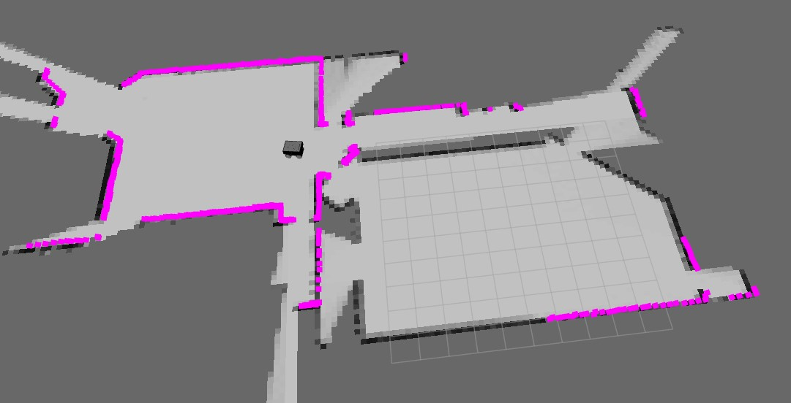
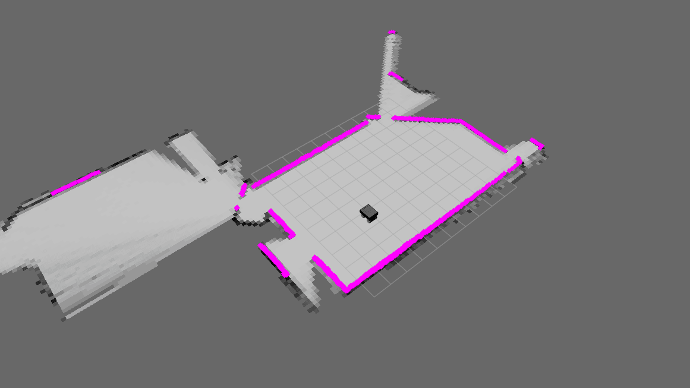

# Summit XL Navigation 
## Description
In this project, we will be using the Summit XL robot to navigate in the willow garage environment. We are using ROS to implement all the functionalities from scratch.
The project fulfills the following requirements:
1. Being able to control the robot using the keyboard.
2. Incorporating and fusing the two laser scanners and the odometery readings. 
3. Mapping the environment using known poses.
4. Mapping the environment using unknown poses (SLAM).

## How to run the code?
``` bash
roslaunch summit_xl_sim_bringup summit_xls_complete.launch
roslaunch rb/code/src/launch/project.launch 
```

## Used packages
We have used the following packages:
1. [Ira tools](http://wiki.ros.org/ira_laser_tools) to incorporate and fuse the two laser scanners.
2. [tty, termios](https://docs.python.org/3/library/termios.html) To take input from terminal.

## Methodology
### Mapping the environment using known poses
For this task we have used an efficient implementation for the reflective model, using the hits and missed algorithm.

We create two replicas for the map, one for the hits and one for the misses. We then use the following formula to calculate the probability of a cell being occupied:
$Prob = \frac{hits}{hits + misses} * 100$

We have multiplied by 100 as the probability is a number between 0 and 1, and we want to have a number between 0 and 100 our occupancy grid.

So, how did we get the hits and misses? We have used the laser scanner readings to update the map. We get the the robot's position and calculate the end point of the laser beam. We then use the Bresenham's algorithm(actually we have created a more efficient implementation using vectorization) to get all the cells that the laser beam passes through. We then update the map accordingly.

### Mapping the environment using unknown poses (SLAM)
For this task we have used the same map function as the one used for the known poses. However, we have used Kalman filter to estimate the robot's pose. We have used the laser scanner readings to update the map. We have used the following formula to calculate the robot's pose:

Get the robot's velocity to use it in the prediction step:

$Vmap_x = V_x * cos(\theta_{t-1}) - V_y * sine(\theta_{t-1})$

$Vmap_y = V_x * sine(\theta_{t-1}) + V_y * cos(\theta_{t-1})$

$V_\theta = V_\theta$

We can ignore the $V_y$ term as it is always 0.

Prediction step:

$x_t' = x_{t-1} + \Delta t * Vmap_x$

$y_t' = y_{t-1} + \Delta t * Vmap_y$

$\theta_t' = \theta_{t-1} + \Delta t * V_\theta$

Correction step:

$x_t = x_t' + K * (z_x - H * x_t')$

$y_t = y_t' + K * (z_y - H * y_t')$

$\theta_t = \theta_t' + K * (z_\theta - H * \theta_t')$

Where $K$ is the Kalman gain, $z$ is the laser scanner reading, $H$ is the measurement matrix which is a scaler equals to 1 and $pose$ is the robot's pose.

Kalman gain: 

$K = \frac{P_{t-1}}{P_{t-1} + R}$

We have used k=0.6 to simulate the uncertainty in the laser scanner readings.

We have used linear equations to calculate the robot's pose, so we didn't have to use the Jacobian matrix or extended Kalman filter.

## Architecture
### Nodes
1. [control](src/control/scripts/control.py): This node is responsible for controlling the robot's movement using the keyboard.
2. [combiner](src/sensor/scripts/combiner.py): This node is responsible for incorporating and fusing the robot's odometry and laser scanner readings and publish them to the map node.
3. [map_known](src/map/scripts/map_known.py): This node is responsible for the mapping the environment using known poses.
4. [map_unknown](src/map/scripts/map_unknown.py): This node is responsible for the mapping the environment using unknown poses (SLAM).
### Topics
1. `/cmd_vel`: This topic is used to control the robot's movement.
2. `/robot/robotnik_base_control/odom`: This topic is used to publish the robot's odometry readings.
2. `/sensor_multi`: This topic is used to publish the robot's incoaperated laser scanner readings.
2. `/sensors`: This topic is used to publish the robot's odometry and laser scanner readings.
3. `/occupancy_map`: This topic is used to publish the map of the environment.
### Messages
1. [CombinedSensor](src/sensor/msg/CombinedSensor.msg): This message is used to publish the robot's odometry and laser scanner readings.

## Results
### Mapping with known poses:

### SLAM: 



<!-- ## Contributors
1. Ahmed Ihab, 102 -> Req 1, 3
2. Ahmed Waleed, 113 -> Req 3, 4
3. Mohamed Salama: 215 -> Req 3, 4
4. Mostafa Wael: 228 -> Req 2, 3, 4 -->


## Developer Guide (How to ...?)
### How to launch Gazebo + rViz
``` bash
roslaunch summit_xl_sim_bringup summit_xls_complete.launch
```
### How to list ROS topics related to robot movement commands
``` bash
rostopic list | grep cmd_vel
```
Note: that you should be running the simulator since that's what publishes to
the topic.

### How to Control robot movement
``` bash
rosrun teleop_twist_keyboard teleop_twist_keyboard.py /cmd_vel:=/robot/robotnik_base_control/cmd_vel
```
### How to run a node
``` bash
rosrun <package_name> <script_name>.py
```
example:
``` bash
rosrun sensor sensor.py
```
### How to create a new package
``` bash
catkin_create_pkg <package_name> [depend1] [depend2] [depend3]
mkdir -p <package_name>/scripts
touch <package_name>/scripts/<script_name>.py
```
example:
``` bash
catkin_create_pkg sensor rospy 
mkdir -p sensor/scripts
touch sensor/scripts/sensor.py
```
### How to run the Iris node
``` bash
roslaunch ira_laser_tools laserscan_multi_merger.launch
```
### How to create and add new messgaes
Follow the instructions in the [ROS wiki](http://wiki.ros.org/ROS/Tutorials/CreatingMsgAndSrv) 
